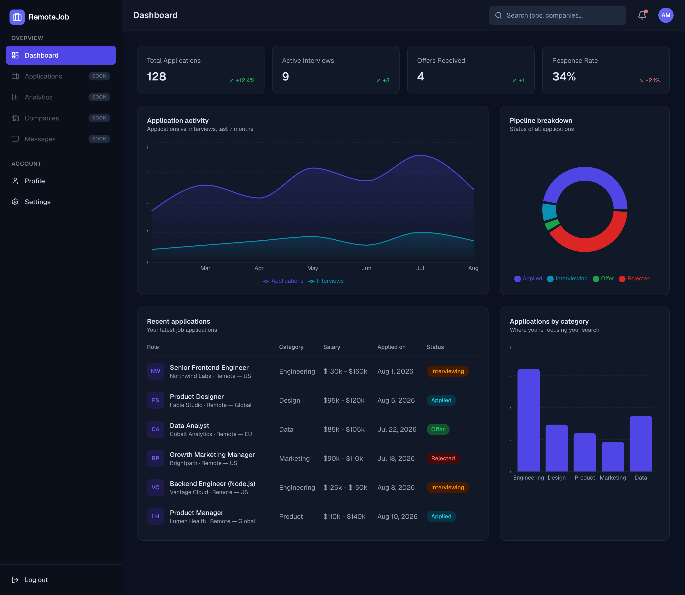
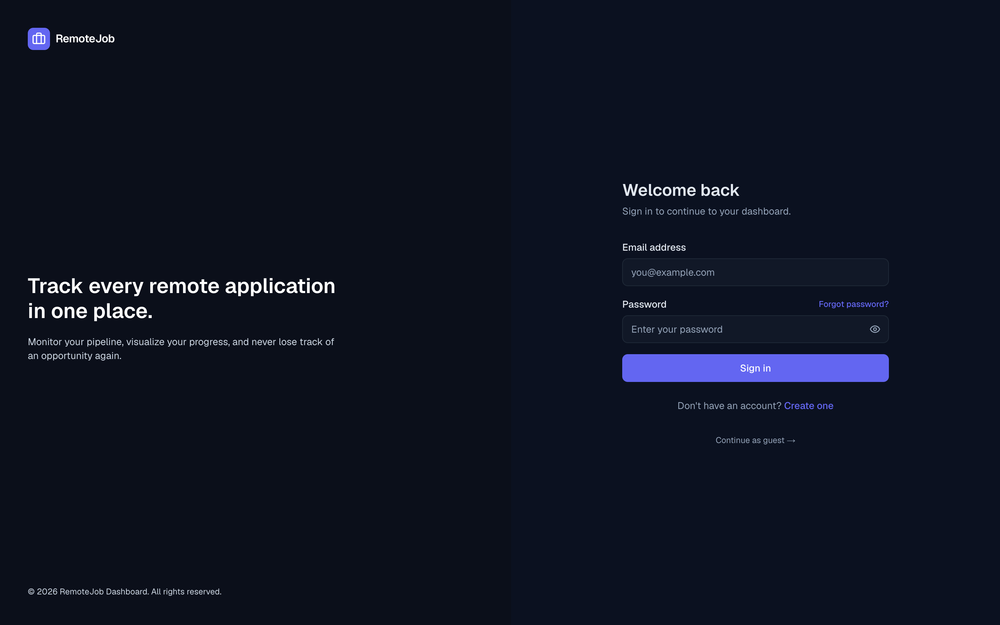
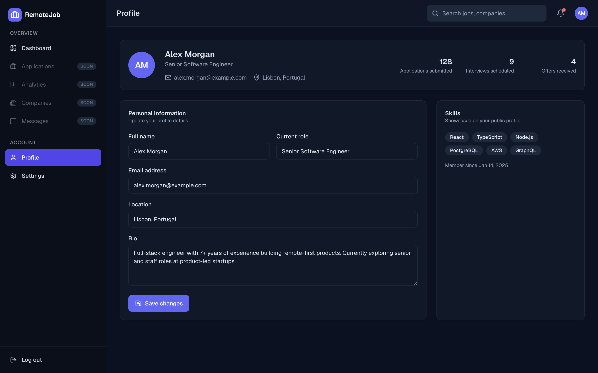
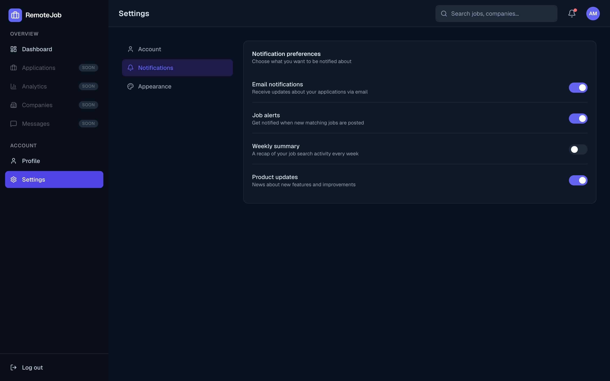
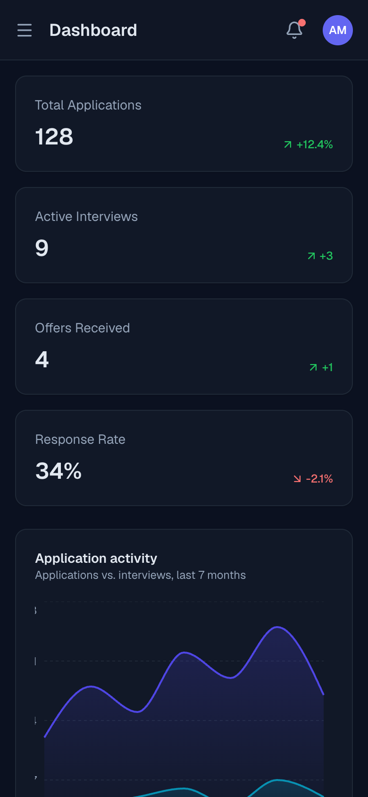

# Remote Job Dashboard

A modern, responsive dashboard for tracking remote job applications — built with **Next.js 15** (App Router), **TypeScript**, and **Tailwind CSS v4**. Includes authentication UI backed by a real middleware route guard, streaming server components with Suspense skeletons, interactive charts, and a full profile/settings experience.

[](https://github.com/Luanafrtd/remote-job-dashboard/actions/workflows/ci.yml)
[](https://remote-job-dashboard.vercel.app)


[](https://vercel.com/new/clone?repository-url=https://github.com/Luanafrtd/remote-job-dashboard)

## Live Demo

### 🔗 [remote-job-dashboard.vercel.app](https://remote-job-dashboard.vercel.app)

Deployed on Vercel, connected to this repo — every push to `main` auto-deploys. The root URL redirects to `/login`; sign in with any non-empty email/password, or use **Continue as guest**, to reach the protected dashboard (there's no real backend, so any input works).

> **Note:** This is a front-end portfolio project. Authentication is a real middleware-enforced route guard, but the "session" it checks is a demo cookie set on submit — there is no backend or database behind it. See [Notes on the mock backend](#notes-on-the-mock-backend) for what a production swap-in looks like.

## Overview

Remote Job Dashboard is a self-contained demo of what a production job-search tracker's front end looks like: a protected dashboard behind real middleware, streaming server components, a full auth flow, and a profile/settings area — all statically prerendered and deployed on Vercel. It exists to show how the pieces of a modern Next.js App Router app fit together: route groups, server/client component boundaries, a swappable data-access layer, and production metadata, rather than to be a real product with a backend.

## Screenshots

|                  Dashboard                   |                Sign in                 |
| :------------------------------------------: | :------------------------------------: |
|  |  |

|                 Profile                  |                  Settings                  |
| :--------------------------------------: | :----------------------------------------: |
|  |  |

<p align="center">
  
</p>

## Features

- **Protected dashboard** — `middleware.ts` redirects unauthenticated visitors to `/login?from=<path>` and sends authenticated visitors away from the auth pages, mirroring how a real app gates its routes
- **Streaming dashboard** — each dashboard section (metrics, trend chart, pipeline chart, category chart, recent applications) is its own async server component wrapped in `<Suspense>`, so slow sections don't block fast ones, with matching skeleton fallbacks
- **Authentication UI** — login and register pages with client-side validation, password visibility toggle, and a split-screen layout
- **Sidebar navigation** — responsive, collapses into a mobile drawer (with focus-safe Escape-to-close and scroll lock), active-route highlighting
- **Profile page** — editable personal info, skills, and activity summary
- **Settings page** — tabbed account, notification, and appearance preferences with real client-side validation and toast feedback
- **Charts** — built with [Recharts](https://recharts.org/), fully responsive and theme-aware via CSS custom properties
- **Branded error handling** — custom `not-found.tsx`, section-scoped `error.tsx` (keeps the sidebar visible on failure), and a root `global-error.tsx`
- **Generated brand assets** — favicon, apple touch icon, and Open Graph image are generated at build time with `next/og`, not static files
- **Dark mode** — automatic based on system preference
- **Responsive design** — works from mobile through desktop breakpoints
- **Production metadata** — `robots.ts`, `sitemap.ts`, `manifest.ts`, and security response headers configured out of the box

## Tech Stack

| Category  | Technology                                      |
| --------- | ----------------------------------------------- |
| Framework | [Next.js 15](https://nextjs.org/) (App Router)  |
| Language  | TypeScript                                      |
| Styling   | Tailwind CSS v4                                 |
| Charts    | Recharts                                        |
| Icons     | lucide-react                                    |
| Linting   | ESLint (`eslint-config-next`) + Prettier        |
| CI        | GitHub Actions (lint, typecheck, format, build) |

## Architecture

A few decisions worth calling out, since they're the part a code review would actually focus on:

- **Route groups own their layout.** `(auth)` renders the split-screen auth shell; `(dashboard)` renders the sidebar/topbar shell. Neither leaks into the other, and the URL structure stays flat (`/login`, `/dashboard`, not `/auth/login`).
- **Server components fetch, client components interact.** `page.tsx` files are server components that export `metadata` and stay thin. Interactive logic (forms, tabs, toggles) lives in a colocated client component (e.g. `ProfileView.tsx`, `LoginForm.tsx`) — this is what lets `/profile` and `/settings` have real per-page `<title>` tags despite being fully interactive.
- **A real (if simulated) data-access layer.** `src/lib/api.ts` is `server-only` and exposes `async` functions with artificial latency, standing in for real API/database calls. `src/lib/data.ts` holds the raw mock records. Swapping in a real backend means changing the _bodies_ of the functions in `api.ts` — no call site changes.
- **Suspense boundaries, not spinners.** The dashboard page composes five independent `<Suspense>` boundaries (`src/app/(dashboard)/dashboard/sections.tsx` + `skeletons.tsx`) instead of one big loading flag. In dev, or once real per-request data is wired in, sections stream in as they resolve. Because the current data is fully static, Next.js correctly prerenders the whole page at build time — the architecture is streaming-ready without paying a runtime cost for data that doesn't need it.
- **Middleware-enforced auth, not just hidden links.** `src/middleware.ts` checks a session cookie against `PROTECTED_ROUTES` from `src/lib/routes.ts` on every request — visiting `/dashboard` directly with no session bounces you to `/login` before any page code runs.
- **Charts receive data as props.** Chart components (`src/components/charts/*`) don't import the data module themselves; they're generic renderers fed by their parent section. This keeps them reusable and independently testable.

## Project Structure

```
src/
├── app/
│   ├── (auth)/                  # Auth route group (centered split-screen layout)
│   │   ├── login/
│   │   │   ├── page.tsx         # Server component, exports metadata
│   │   │   └── LoginForm.tsx    # Client component, the actual form
│   │   └── register/
│   ├── (dashboard)/             # Dashboard route group (sidebar + topbar layout)
│   │   ├── dashboard/
│   │   │   ├── page.tsx         # Composes sections in <Suspense> boundaries
│   │   │   ├── sections.tsx     # Async server components (the "data fetches")
│   │   │   └── skeletons.tsx    # Matching loading fallbacks
│   │   ├── profile/
│   │   ├── settings/
│   │   └── error.tsx            # Scoped error boundary (sidebar stays visible)
│   ├── icon.tsx                 # Generated favicon (next/og)
│   ├── apple-icon.tsx           # Generated apple-touch-icon
│   ├── opengraph-image.tsx      # Generated OG/social preview image
│   ├── manifest.ts              # PWA manifest
│   ├── robots.ts / sitemap.ts   # SEO metadata routes
│   ├── error.tsx / global-error.tsx / not-found.tsx
│   ├── layout.tsx               # Root layout (fonts, metadataBase, OG defaults)
│   └── globals.css              # Theme tokens & Tailwind entrypoint
├── components/
│   ├── charts/                  # Recharts wrappers, data passed via props
│   ├── dashboard/                # Dashboard-specific composites (table, etc.)
│   ├── layout/                    # Sidebar, Topbar, Logo, DashboardShell
│   └── ui/                         # Reusable primitives (Button, Card, Toast, ...)
├── lib/
│   ├── api.ts                   # server-only async data-access layer
│   ├── data.ts                  # Raw mock/sample data
│   ├── routes.ts                # Route + protected-route constants
│   ├── session.ts               # Demo cookie session helpers
│   ├── site.ts                  # Site URL/name/description for metadata
│   └── utils.ts                 # cn(), formatDate(), initials()
├── types/
│   └── index.ts                 # Shared TypeScript types
└── middleware.ts                # Route protection
```

## Getting Started

### Prerequisites

- Node.js 18.18 or later (see `.nvmrc`)
- npm (or pnpm/yarn — adjust commands accordingly)

### Installation

```bash
npm install
```

### Run the development server

```bash
npm run dev
```

Open [http://localhost:3000](http://localhost:3000). The root route redirects to `/login`; sign in with any non-empty email/password (or use **Continue as guest**) to reach the dashboard — there's no real backend, so any input works.

### Available Scripts

| Command                | Description                            |
| ---------------------- | -------------------------------------- |
| `npm run dev`          | Start the development server           |
| `npm run build`        | Create an optimized production build   |
| `npm run start`        | Run the production build locally       |
| `npm run lint`         | Run ESLint                             |
| `npm run typecheck`    | Run the TypeScript compiler (no emit)  |
| `npm run format`       | Format the codebase with Prettier      |
| `npm run format:check` | Check formatting without writing files |

## Routes

| Route        | Access    | Description                                    |
| ------------ | --------- | ---------------------------------------------- |
| `/`          | Public    | Redirects to `/login`                          |
| `/login`     | Public*   | Sign-in form                                   |
| `/register`  | Public*   | Account creation form                          |
| `/dashboard` | Protected | Metrics, charts, and recent applications       |
| `/profile`   | Protected | User profile and editable personal information |
| `/settings`  | Protected | Account, notification, and appearance settings |

\* Redirects to `/dashboard` if you already have a session.

## Deployment

This project is zero-config on [Vercel](https://vercel.com) — it's a standard Next.js App Router app with no required environment variables.

1. Push this repo to GitHub (already done if you're reading this on GitHub).
2. Import it at [vercel.com/new](https://vercel.com/new), or click the **Deploy with Vercel** button above.
3. Vercel auto-detects the Next.js framework preset — no build command overrides needed.
4. Deploy.

**Optional environment variable:**

| Variable               | Purpose                                                                                                                                                                                   |
| ---------------------- | ----------------------------------------------------------------------------------------------------------------------------------------------------------------------------------------- |
| `NEXT_PUBLIC_SITE_URL` | Absolute site URL used for `metadataBase` and the sitemap. Defaults to Vercel's own production URL (`VERCEL_PROJECT_PRODUCTION_URL`) when unset, so you generally don't need to set this. |

**Production readiness checklist** (already handled in this repo):

- ✅ Security response headers (`X-Frame-Options`, `X-Content-Type-Options`, `Referrer-Policy`, `Permissions-Policy`) set in `next.config.ts`
- ✅ `robots.ts` disallows the authenticated routes from indexing while keeping auth pages crawlable
- ✅ `sitemap.ts` and `manifest.ts` for SEO/PWA metadata
- ✅ `metadataBase` configured so Open Graph/Twitter image URLs resolve correctly in production
- ✅ CI pipeline (`.github/workflows/ci.yml`) runs format check, lint, typecheck, and build on every push/PR
- ✅ All routes statically prerendered (`○ (Static)` in the build output) — no server compute needed for the current mock data

## Notes on the mock backend

- **Authentication** is enforced by real middleware (`src/middleware.ts`), but the session it checks is a plain cookie set client-side on form submit (`src/lib/session.ts`) — there's no password verification. To make it real: replace `createSession()`/`destroySession()` with calls to an auth provider (NextAuth.js, Clerk, Supabase Auth, etc.) that sets an httpOnly cookie, and the middleware logic doesn't need to change.
- **Data** lives in `src/lib/data.ts` and is served through the async functions in `src/lib/api.ts`. Swap the function bodies for real `fetch()`/ORM calls — the Suspense boundaries and prop-typed components downstream don't need to change.

## Roadmap

Ideas for a next iteration, in rough priority order:

- Wire up a real auth provider and database
- Playwright end-to-end tests covering the login → dashboard → logout flow
- Persist the theme toggle on the Settings page (currently UI-only)
- Filtering/sorting/pagination on the applications table
- Turn the "Soon" sidebar items (Applications, Analytics, Companies, Messages) into real pages

## License

[MIT](LICENSE) © Luana Furtado
